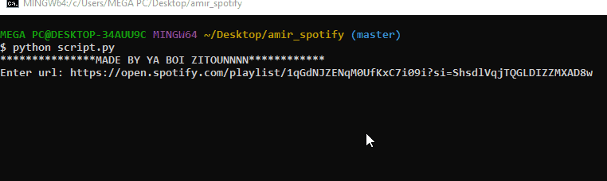

# Spotify_Downloader
this python script allows you to download songs from spotify playlist
but you need to have ffmpeg installed on your pc in order to use it




### Usage
clone the repo using
```
$ git clone https://github.com/Amine-Zitoun/spotify_downloader
```
install dependencies
```
$ cd spotify_downloader
$ pip install -r requirements.txt
```
then run the script.py file :D
